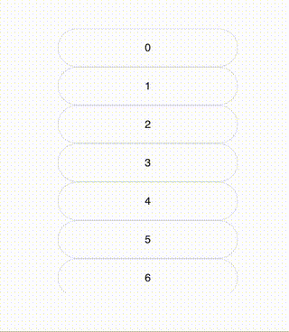

# virtualtable


An implementation of a table displaying large data sets. See [doc](./docs/doc.md) for more details.

<p align="center">

</p>

## Getting Started

Make sure you have [Yarn](https://classic.yarnpkg.com/en/docs/install/) installed.

Install dependencies:

```bash
yarn install
```

Start the test app:

```bash
yarn start
```

The app will be available at `localhost:9001`.

## Styling VirtualTable

To style the VirtualTable, supply a CSS module with the following optional class names:

- `item`: Applied to each table item.
- `hover`: Applied when an item is hovered.
- `select`: Applied when an item is selected.

Example CSS module (`MyTableStyles.module.css`):

```css
.item { /* base item styles */ }
.hover { /* hover styles */ }
.select { /* selected item styles */ }
```

Example usage:

```jsx
import styles from './MyTableStyles.module.css';

<VirtualTable style={styles} ... />
```

See [index.css](/testApp/src/index.css) from [testApp](/testApp/).
