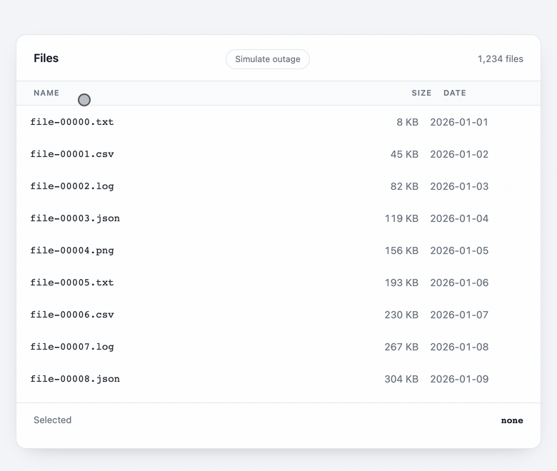

# virtualtable


An implementation of a table displaying large data sets. See [doc](./docs/doc.md) for more details.

<p align="center">

</p>

## Getting Started

Make sure you have [Yarn](https://classic.yarnpkg.com/en/docs/install/) installed.

Install dependencies and build the package:

```bash
yarn install
yarn build
```

The demo resolves the package from `dist`, so it will not start until the build
has run at least once.

Run the demo:

```bash
cd demo
yarn install
yarn start
```

The app will be available at `localhost:9001`. The "Simulate outage" toggle in
the demo breaks the data source, so you can watch the failure handling work.

## Usage

```jsx
import { VirtualTable } from '@krjakbrjak/virtualtable';

class Items {
    // Returns `count` items starting at `index`, plus the size of the
    // whole collection.
    fetch(index, count) {
        return fetch(`/api/items?offset=${index}&limit=${count}`).then((r) => r.json());
    }
}

const source = new Items();

<VirtualTable
    fetcher={source}
    renderer={(item) => (item ? <Row item={item} /> : <Skeleton />)}
/>;
```

The table has no height of its own, so give the element that contains it one.

### Rows are all one height

The table measures the first row and reuses that height for every other one.
Scroll position, how many rows are fetched, and which row the pointer is over
are all derived from that single measurement, so rows have to render at a
consistent height. A placeholder that is shorter than a loaded row is the usual
way to get this wrong; so is text long enough to wrap onto a second line.

Rows are clipped to the measured height, so a row that renders taller loses its
overflow rather than pushing the rows below it out of step.

## Props

| Prop         | Type                                    | Default    | Description                                                                       |
| ------------ | --------------------------------------- | ---------- | --------------------------------------------------------------------------------- |
| `fetcher`    | `DataSource<Type>`                      | _required_ | Supplies the items, a page at a time.                                             |
| `renderer`   | `(item) => ReactNode`                   | _required_ | Renders one row. Called with `undefined` while the row's page is still loading.    |
| `style`      | `Style`                                 | none       | Class names for row states, see [Styling](#styling-virtualtable).                 |
| `striped`    | `boolean`                               | `false`    | Passed through to the underlying table.                                           |
| `onSelected` | `(index: number, item: Type) => void`   | none       | Called once per selection, with the selected item.                                |
| `onError`    | `(page: number, error: unknown) => void`| none       | Called every time a page fails to load, retries included.                         |

Replacing `fetcher` discards the current collection and starts again, so build it
once rather than inline in the render.

### Data source

```ts
interface Result<Type> {
    from: number; // index the items start at
    items: Array<Type>;
    totalCount: number; // size of the whole collection
}

interface DataSource<Type> {
    fetch(index: number, count: number): Promise<Result<Type>>;
}
```

`fetch` is also called with a count of 1 before anything is rendered, to measure
how tall a row is.

### Selection

`onSelected` reports the row the user clicked. If that row's page has not been
fetched yet the call is deferred until it has, so the item is always supplied
rather than the index alone. Only one call is made per selection.

Selection is currently pointer-only: there is no keyboard path to it.

### Failures

A page that fails to load is retried for as long as it is on screen, with the
delay doubling from one second up to a ceiling of thirty. There is no attempt
limit, because nothing on the client can know when a source recovers; a source
that comes back is picked up on the next attempt without the consumer doing
anything. Retries are only scheduled for pages in view, so scrolling away stops
them and scrolling back resumes them.

`onError` fires on every failure, so expect repeated calls for the same page
during an outage rather than one per page. Failures of the row-measuring fetch
described above are reported against page 0.

A failed row is passed to `renderer` as `undefined`, the same as one that is
still loading. If the very first fetch fails, nothing is rendered at all, since
the size of the collection is only learned from a successful response.

## Styling VirtualTable

To style the VirtualTable, supply a CSS module with the following optional class names:

- `item`: Applied to each table item.
- `hover`: Applied when an item is hovered.
- `select`: Applied when an item is selected.

Example CSS module (`MyTableStyles.module.css`):

```css
.item { /* base item styles */ }
.hover { /* hover styles */ }
.select { /* selected item styles */ }
```

Example usage:

```jsx
import styles from './MyTableStyles.module.css';

<VirtualTable style={styles} ... />
```

See [index.module.css](/demo/src/index.module.css) from the [demo](/demo/).
